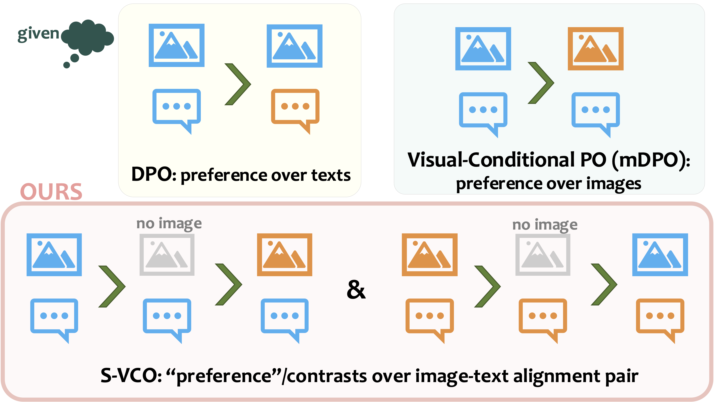

<br>
<div align="center">
<h1>S-VCO: Symmetrical Visual Contrastive Optimization — Aligning Vision-Language Models with Minimal Contrastive Images</h1>

[](https://s-vco.github.io)
[](https://arxiv.org/abs/2502.13928)
</div>

**S-VCO** is a finetuning method for vision-language models (VLMs) that enhances visually dependent task capabilities while preserving or improving general performance. It operates on contrastive image-text pairs containing detailed visual differences (*e.g.*, [MVC dataset](#dataset)). S-VCO enforces strict supervision over visual conditions, and symmetrically treats both images in each pair as "preferred" when matched with their corresponding texts. This approach ensures balanced optimization over all aligned image-text pairs. The figure below illustrates how S-VCO differs from text-based<sup>[1](https://github.com/eric-mitchell/direct-preference-optimization),[2](https://github.com/YiyangZhou/POVID)</sup> or image-based<sup>[3](https://feiwang96.github.io/mDPO)</sup> preference tuning:

<p align="center">

</p>


<a name="dataset"></a>
## DATASET

> **MVC** is a contrastive paired image-text dataset derived from visual counterfactual data sources<sup>[4](https://github.com/HanSolo9682/CounterCurate),[5](https://github.com/liujunzhuo/FineCops-Ref)</sup>. It is automatically filtered to retain only visually challenging pairs with meaninfully distinct semantic details, and then augmented for diversified language.

### DOWNLOAD DATA SOURCES

Make sure that [Git LFS](https://github.com/git-lfs/git-lfs) is installed. Then run:

```bash
bash prepare_source_data.sh
```

This script, adapted from the [CounterCurate](https://github.com/HanSolo9682/CounterCurate) & [FineCops-Ref](https://github.com/liujunzhuo/FineCops-Ref) repositories, downloads and prepares the source data .
After running it, you will find three image folders: ``flickr30k``, ``Flickr30k-Counterfactuals``, ``finecops-ref``. 

### FILTERED & AUGMENTED MVC

The MVC dataset used in the paper is provided as `data/mvc.json`, with image paths pointing to the folders created in the previous step. 
This version of MVC is filtered according to [CLIP](https://huggingface.co/google/siglip-so400m-patch14-384)-similarity > 0.7 and [DINOv2](https://huggingface.co/facebook/dinov2-large)-similarity < 0.5. Language augmentation is performed by prompting GPT-4o in two stages, as described in [Appendix C of the paper]().

To divide the dataset into training and validation sets, use the following command:

```bash
python divide_train_val.py --val_num 240 \
                           --train_file data/mvc_train.json \
                           --val_file data/mvc_val.json                        
```

> Note that for the non-synthetic *"Left-Right"* position flipping, we do not apply the filter. Instead, we randomly sample data based on the original category distribution in the sources. We also discard the *"Order"* category from [FineCops-Ref](https://github.com/liujunzhuo/FineCops-Ref) due to frequent irrational cases.


## RUNNING S-VCO

### ENVIRONMENT

Create an S-VCO environment running on [CUDA 11.8](https://developer.nvidia.com/cuda-11-8-0-download-archive) by:

```bash
conda create -n svco python=3.10
conda activate svco
conda install conda-forge::cudatoolkit-dev
bash env/install_svco_env.sh
source activate svco
```

We use ``trl==0.7.2`` with a slightly modified ``core.py`` and ``transformers==4.45.2`` with a slightly modified ``modeling_llava.py`` to resolve dependency issues and to better integrate loss calculation in our ``trainer.py``. To apply these modifications, replace the original files by:

```bash
cp env/transformers4.45.2_modeling_llava_modified.py "$CONDA_PREFIX/lib/python3.10/site-packages/transformers/models/llava/modeling_llava.py"
cp env/trl0.7.2_core_modified.py "$CONDA_PREFIX/lib/python3.10/site-packages/trl/core.py"
```

Note that this environment is also used for [benchmark evaluation](#evaluation).


### TRAINING

We provide an example script to run S-VCO on [LLaVA-NeXT-Interleave-7B](https://huggingface.co/llava-hf/llava-interleave-qwen-7b-hf) using 8 A100x80G GPUs:

```bash
bash run_svco_example.sh
```

Configure hyperparameters in the script as needed.

We also support [LLaVA-1.5](https://huggingface.co/llava-hf/llava-1.5-7b-hf) as base VLM. 
For other models, remember to modify the data processing and model loading functions in ``data_collator.py`` and ``run.py``. 
You may also need to adapt the model forward logics in ``trainer.py``, and similarly adjust the ``transformer`` library's ``modeling_{YOUR_MODEL}.py`` to mirror our changes in ``modeling_llava.py``.


<a name="evaluation"></a>
## EVALUATION

### DOWNLOAD BENCHMARK DATA
To download all the image data for the benchmarks used in the paper, run:

```bash
bash prepare_benchmark_data.sh
```

### RUNNING EVALUATION ON BENCHMARKS
We provide a script to evaluate a finetuned checkpoint (*e.g.*, based on [LLaVA-NeXT-Interleave-7B](https://huggingface.co/llava-hf/llava-interleave-qwen-7b-hf)) on all benchmarks mentioned in the paper:

```bash
bash eval_all.sh --model_base=llava-hf/llava-interleave-qwen-7b-hf \
                 --run_name={EXPERIMENT_NAME_FOR_LOGGING} \
                 --ckpt_path={SAVED_CKPT_ABS_PATH} \
                 --openai_key={OPENAI_KEY} \
                 --device=0
```

Running this will create a ``LOG_EVAL/{RUN_NAME}/`` folder containing the evaluation results for each benchmark, stored as ``{BENCHMARK_NAME}.txt``.

Our evaluation scripts build on repositories<sup>[6](https://github.com/haotian-liu/LLaVA/blob/main/docs/Evaluation.md),[7](https://github.com/RLHF-V/RLHF-V?tab=readme-ov-file#evaluation),[8](https://github.com/yuweihao/MM-Vet)</sup> with additional benchmark datasets<sup>[9](https://huggingface.co/datasets/nyu-visionx/CV-Bench),[10](https://github.com/RLHF-V/RLHF-V?tab=readme-ov-file#evaluation),[11](https://huggingface.co/datasets/xai-org/RealworldQA)</sup>.


## CITATION

```

```
